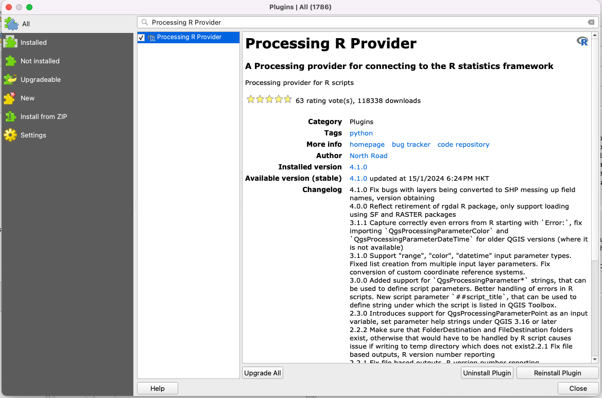
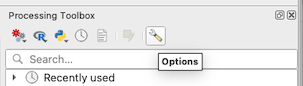
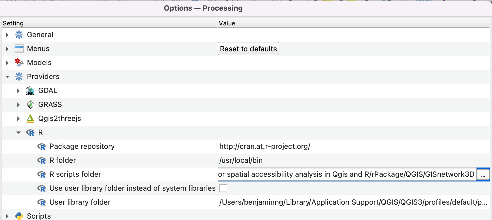
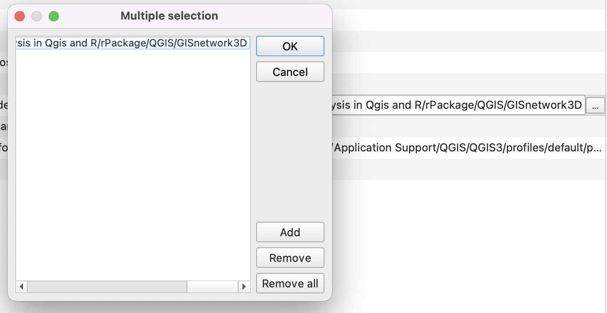
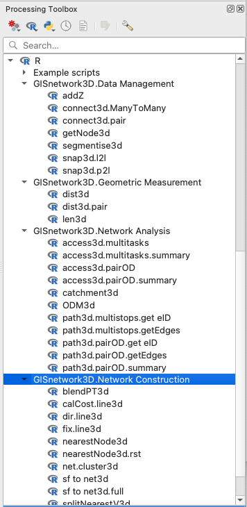

# **`GISnetwork3D` − An open-sourced 3D GIS and 3D spatial access measurement tool in R and QGIS**

A package for 3D GIS operation and 3D network analysis.

## Brief Introduction

Traditional map-making and GIS software have long adhered to a planar conception of space. Contrary to proprietary GIS software, open-source alternatives like QGIS and R currently lack comparable capabilities to perform even simple 3D GIS operations and 3D network analysis. Therefore, to bridge this divide, we developed an innovative R package that empowers users to perform 3D GIS operations and advanced 3D network analyses, bringing the power of 3D modelling into open-source environments. Additionally, by linking QGIS with this R package, we seek to create a user-friendly, code-free platform that democratises access to advanced 3D GIS functionalities, fostering new insights and applications across disciplines.

The `GISnetwork3D` has the following objectives:

1.  **Supports 3D geometry operations:** Provides functionality for measuring the geometry of 3D objects and querying spatial and topological relationships between 3D geometries. Examples include 3D length measurement, K-nearest neighbour analysis, distance calculation, and snapping functions.

2.  **Supports automated/convenient 3D path cost calculation:** Supports calculating the path cost for each segment (pre-calculated walking time and energy consumption), and aggregates the results without requiring segmentation of the entire network.

3.  **Supports slope and direction-aware 3D routing:** This routing tool considers the following factors simultaneously: (1) path direction; (2) a single linestring with dual weight by directions; (3) a network containing both one-way and two-way paths (some paths have dual weights, while others have only one).

4.  **Supports user-friendly, comprehensive 3D accessibility analysis:** Provides user-friendly functionality for: (1) single-purpose and multi-purpose accessibility analysis, (2) path attribute summary and (3) route geometry generation in one single code/function.

# Cheatsheets

## 1. Geometry Operation


**Fig 1.** Cheatsheet for Geometry Operation

## 2. Network Construction


**Fig 2.** Cheatsheet for Network Construction

## 3. Network Analysis


**Fig 3.** Cheatsheet for Network Construction

# Tutorial

A step-by-step demonstration of the R package in R and QGIS from installation to application using sampled data can be accessed through this link. All of the documentation and data needed are stored inside this Google Drive link.\
<https://drive.google.com/drive/folders/1edYp9Kd6P8l2WTPMmPF1x_j0_ydenFPS?usp=sharing>

Inside the folder, there are **"R"** and **"QGIS"** folders, in which the step-by-step tutorials and data are stored. Please **download the folders and open the file with the ".html" extension in sequence to read the step-by-step guide for installing and applying** this package.

# Installing R Package

The R package is hosted on GitHub. The installation requires the `remotes` package for this process. Please run the following code only if you do not have `remotes` installed.

``` r
install.packages("remotes")
```

Then, you can install the `GISnetwork3D` package directly from the GitHub. This package relies on the following R packages: `Rcpp`, `sf`, `dplyr`, `igraph`, `raster`, `sfheaders`, `purrr`, `furrr`, `future` and `BH`. Their availability will be detected and be installed, in case missing, automatically during the installation of the `GISnetwork3D` package.

``` r
library(remotes) 
remotes::install_github("NKY-B/GISnetwork3D")
```

# Installing QGIS Tool

**!!!!!!! Please first install the R Package in R as stipulated in the last step.**

## Install `Processing R Provider` in QGIS

The running of R code in QGIS requires the “Processing R Provider” Plugin in QGIS. This Plugin serves as a bridge between R and QGIS. Please follow the procedures below for installation.

1.  Open the QGIS.
2.  On the top bar, click “Plugins \> Manage and Install Plugins…”
3.  Then, search the PlugIn name “Processing R Provider” in the search box. (**Fig. 4**)



**Fig 4.** Search PlugIn

4.  Click “Install Plugin”

5.  In the “Processing Toolbox”, please click “Options” (**Fig. 5**)



**Fig 5.** Access setting of Proccessing Toolbox

6.  Expands the “Providers” and “R”. Make sure that the directory of the “R folder” is correctly linked to R.

7.  More details concerning the installation can be found on the URL (<https://north-road.github.io/qgis-processing-r/>

## Install `GISnetwork3D` in QGIS

The final step is to install the `GISnetwork3D` in QGIS.

1.  Go to <https://drive.google.com/drive/folders/1F8eKH90zswzbjCos7u12TL9400kUHFON?usp=sharing> and download the folder "GISnetwork3D".

2.  Store the "GISnetwork3D" folder into your preferred location on your computer.

3.  Go to ***“Options \> Providers \> R”***, double click the cell next to the "R script folder" as in (**Fig. 6**) and click the box with three dots. Then, click "**add**" and then link to the folder you haved just downloaded and then click "**OK**" as in (**Fig. 7**).

    

    **Fig 6.** Locate GISnetwork3D folder

    

    **Fig 7.** Link to the GISnetwork3D folder

4.  Then, the installation is completed.

5.  Relaunch the QGIS.

6.  If the package is installed properly, all of the functions should be shown in the “Processing toolbox” (**Fig. 8**).



**Fig 8.** Check Installation
